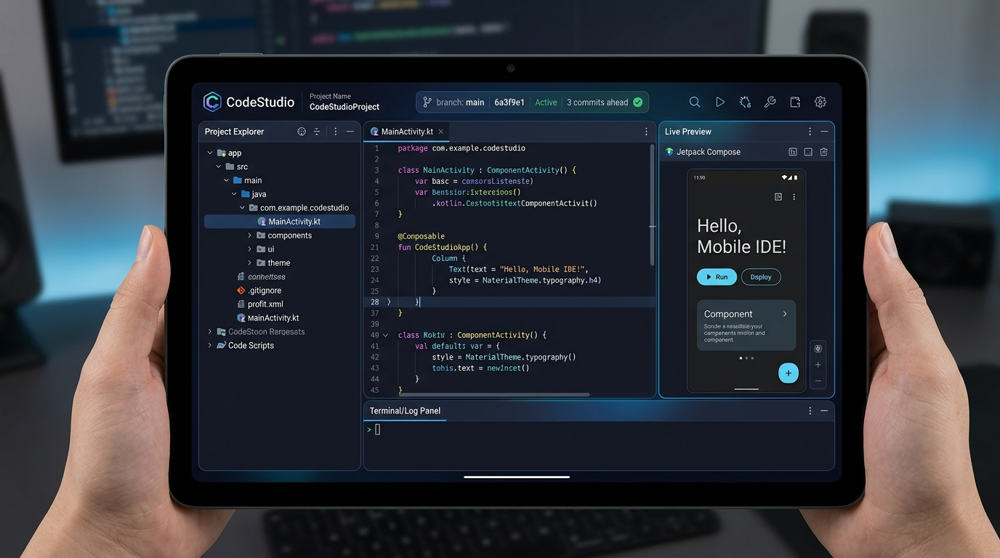
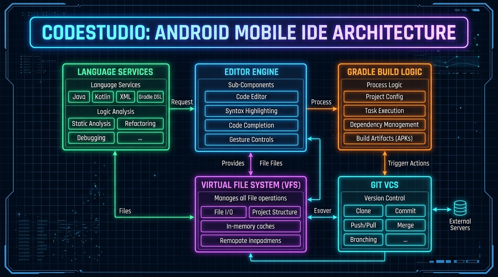
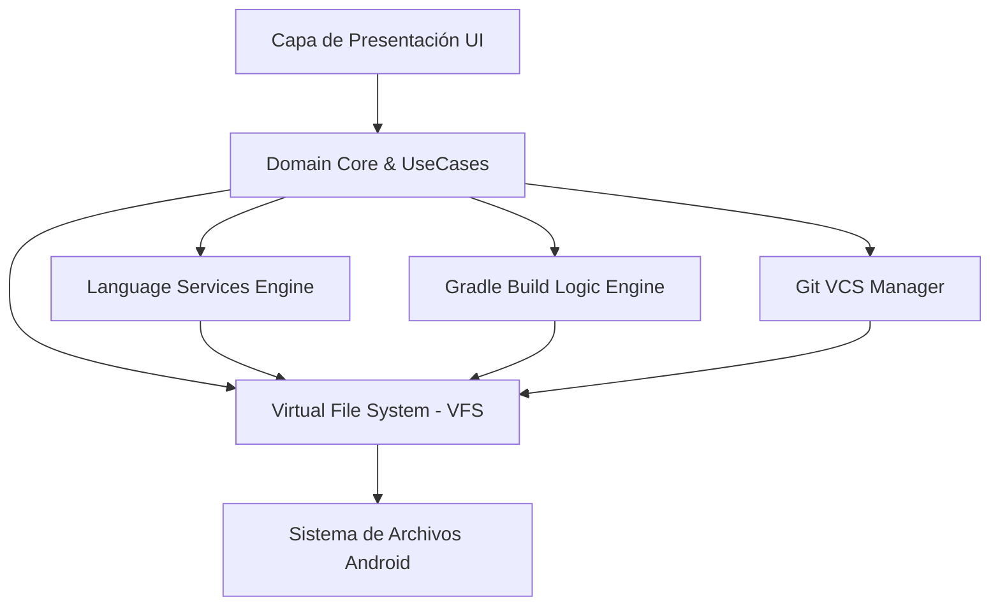

<div align="center">

  

  # ⚡ CodeStudio IDE
  
  **El entorno de desarrollo integrado nativo de próxima generación para dispositivos móviles Android.**

  [](https://kotlinlang.org/)
  [-success.svg?style=for-the-badge&logo=android)](https://developer.android.com/)
  [](https://developer.android.com/jetpack/compose)
  [](LICENSE)
  []()

  <br />

  

  <br />
  <br />

  *Desarrolla, edita, analiza, compila y gestiona repositorios Git completos directamente desde la palma de tu mano.*

</div>

---

## 📋 Tabla de Contenidos

- [💡 Sobre el Proyecto](#-sobre-el-proyecto)
- [✨ Características Principales](#-características-principales)
- [🖼️ Vista Previa e Interfaz](#️-vista-previa-e-interfaz)
- [🛠️ Stack Tecnológico](#️-stack-tecnológico)
- [🏗️ Arquitectura del Sistema](#️-arquitectura-del-sistema)
- [⚡ Módulos del Proyecto](#-módulos-del-proyecto)
- [📱 Requisitos de Instalación](#-requisitos-de-instalación)
- [🚀 Compilación y Configuración Local](#-compilación-y-configuración-local)
- [🗺️ Hoja de Ruta (Roadmap)](#️-hoja-de-ruta-roadmap)
- [🤝 Cómo Contribuir](#-cómo-contribuir)
- [📄 Licencia](#-licencia)

---

## 💡 Sobre el Proyecto

**CodeStudio** nace con la misión de eliminar por completo la dependencia de ordenadores portátiles o de escritorio para el desarrollo de software. No se trata simplemente de un editor de texto ligero con coloreado de sintaxis; es una suite de desarrollo móvil integral diseñada para entender proyectos completos, gestionar dependencias en tiempo real, compilar binarios ejecutables (APKs) y mantener un control de versiones robusto con Git.

Diseñado de forma nativa para la plataforma Android, aprovechando el rendimiento de **Kotlin Coroutines** y la flexibilidad reactiva de **Jetpack Compose + Material Design 3**, CodeStudio ofrece una experiencia fluida, rápida y adaptada a la interacción táctil y teclados externos.

---

## ✨ Características Principales

- 📝 **Editor de Código de Alto Rendimiento:**
  - Lexer incremental con resaltado sintáctico multitono para Kotlin, Java, XML, Gradle DSL y Dart.
  - Autocompletado inteligente contextual de símbolos y declaraciones.
  - Soporte completo para navegación por código (*Go to Definition*, *Find Usages*).
- 📦 **Motor de Compilación e Inspección Nativo:**
  - Orquestación interna del ciclo de construcción Gradle.
  - Generación de APKs ejecutables directamente desde la aplicación.
  - Consola de logs interactiva y detallada en tiempo real.
- 🌿 **Integración Total con Control de Versiones (Git VCS):**
  - Clonado de repositorios remotos por HTTPS.
  - Gestión de ramas (*checkout*, *branch creation*, *merge*).
  - Historial de commits visual, creación de diffs y push/pull directo.
- 🎨 **Diseño Moderno e Interfaz Adaptativa:**
  - Construido desde cero con **Jetpack Compose** y **Material 3**.
  - Temas oscuro y claro optimizados para pantallas móviles y tablets.
  - Soporte de layout de múltiples paneles (Project Explorer, Editor, Live Preview, Terminal).

---

## 🖼️ Vista Previa e Interfaz

<div align="center">
  
  <p><i>Entorno de trabajo multiventana de CodeStudio ejecutando edición de código, preview en vivo y panel de logs.</i></p>
</div>

---

## 🛠️ Stack Tecnológico

| Componente | Tecnología Utilizada |
| :--- | :--- |
| **Lenguaje Principal** | [Kotlin 1.9+](https://kotlinlang.org/) |
| **Framework UI** | [Jetpack Compose](https://developer.android.com/jetpack/compose) + [Material 3](https://m3.material.io/) |
| **Arquitectura** | MVVM + Clean Architecture modular |
| **Concurrencia** | Kotlin Coroutines & Flow |
| **Inyección de Dependencias** | Hilt / Koin Dependency Injection |
| **Persistencia de Datos** | Room Database & Jetpack DataStore |
| **Parsing y AST** | IntelliJ PSI Host & Custom Lexers |
| **Sistema de Build** | Gradle Wrapper con Version Catalogs (`libs.versions.toml`) |

---

## 🏗️ Arquitectura del Sistema

CodeStudio se divide en capas modularizadas con límites bien definidos para garantizar escalabilidad, aislamiento de fallos y máxima velocidad de compilación incremental.

<div align="center">
  
</div>



---

## ⚡ Módulos del Proyecto

El repositorio está estructurado en módulos altamente especializados:

```text
CodeStudio/
├── agent-api / agent-impl     # Integración de agentes inteligentes y asistentes de código
├── analysis-api / impl        # Análisis estático e inspección de código en tiempo real
├── analytics-api / impl       # Métricas de rendimiento e informes de estado
├── android-sdk-metadata       # Metadatos del SDK de Android para autocompletado
├── block-api / impl           # Motor de bloques y editores visuales
├── build-engine / logic       # Motor de compilación interno y orquestación Gradle
├── ide-core / ide-ui          # Componentes principales del entorno de usuario y paneles
├── lang-kotlin / lang-java    # Analizadores de sintaxis por lenguaje (Kotlin, Java, XML, Dart)
├── platform-core              # Servicios base de plataforma, dispatchers y gestión de memoria
├── project-model-api / impl   # Estructura de árbol de proyectos y modelos de dependencias
└── vfs-api                    # Sistema de archivos virtual de baja latencia (VFS)
```

---

## 📱 Requisitos de Instalación

- **Sistema Operativo:** Android 8.0 (API Nivel 26) o superior.
- **Arquitectura Procesador:** ARM64-v8a / x86_64.
- **Memoria RAM:** 3 GB mínimo (4 GB o superior recomendado para proyectos grandes).
- **Almacenamiento:** 250 MB libres para la aplicación + espacio adicional para proyectos.

---

## 🚀 Compilación y Configuración Local

Si deseas compilar **CodeStudio** desde el código fuente o contribuir al desarrollo:

### 1. Clonar el repositorio
```bash
git clone https://github.com/AssassinGhostYT/CodeStudio.git
cd CodeStudio
```

### 2. Configurar variables de entorno y keystore (Opcional para Signed Builds)
Copia el archivo de ejemplo para la firma:
```bash
cp keystore.properties.example keystore.properties
```

### 3. Compilar el APK de desarrollo
Ejecuta el script de Gradle para construir la versión Debug:
```bash
./gradlew assembleDebug
```
El archivo `.apk` compilado estará disponible en la ruta:
`ide-android/build/outputs/apk/debug/ide-android-debug.apk`

---

## 🗺️ Hoja de Ruta (Roadmap)

- [x] Arquitectura multimodular extensible en Kotlin.
- [x] Motor VFS de alta velocidad para manejo de archivos locales.
- [x] Integración inicial con Git VCS.
- [ ] 🔄 **Autocompletado semántico completo** basado en análisis de proyecto global.
- [ ] 🐞 **Depurador interactivo (DAP)** con puntos de interrupción e inspección de variables.
- [ ] 🎨 **Live Preview de Jetpack Compose** rendered en tiempo real.
- [ ] 💻 **Terminal de comandos integrada** con soporte para herramientas CLI.
- [ ] 🧩 **Sistema de plugins de terceros** extensible mediante WebAssembly/Kotlin.

---

## 🤝 Cómo Contribuir

¡Las contribuciones de la comunidad son fundamentales para el crecimiento de CodeStudio!

1. Haz un **Fork** de este repositorio.
2. Crea una rama para tu funcionalidad o corrección:
   ```bash
   git checkout -b feature/nueva-caracteristica
   ```
3. Realiza tus cambios asegurándote de seguir el estilo de código Kotlin predeterminado.
4. Escribe y ejecuta las pruebas unitarias:
   ```bash
   ./gradlew test
   ```
5. Haz **Commit** de tus cambios de forma clara y descriptiva:
   ```bash
   git commit -m "feat: agrega soporte para resaltado en archivos TOML"
   ```
6. Envía un **Pull Request** detallando tus modificaciones.

---

## 📄 Licencia

Este proyecto está distribuido bajo los términos de la Licencia **MIT**. Para más detalles, consulta el archivo [LICENSE](LICENSE).

<div align="center">
  <sub>Desarrollado con ❤️ por la comunidad de CodeStudio.</sub>
</div>
