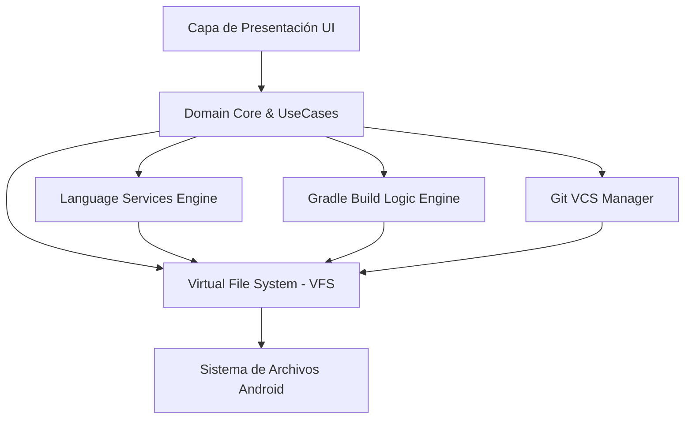

<div align="center">

  

  # ⚡ CodeStudio IDE
  
  **El entorno de desarrollo integrado nativo de próxima generación para dispositivos móviles Android.**

  [](https://github.com/sponsors/AssassinGhostYT)
  [](https://kotlinlang.org/)
  [-success.svg?style=for-the-badge&logo=android)](https://developer.android.com/)
  [](https://developer.android.com/jetpack/compose)
  [](LICENSE)

  <br />

  

  <br />
  <br />

  *Desarrolla, edita, analiza, compila y gestiona repositorios Git completos directamente desde la palma de tu mano.*

</div>


---

## 📋 Tabla de Contenidos

- [💡 Sobre el Proyecto](#-sobre-el-proyecto)
- [✨ Características Principales](#-características-principales)
- [🖼️ Vista Previa e Interfaz](#️-vista-previa-e-interfaz)
- [🛠️ Stack Tecnológico](#️-stack-tecnológico)
- [🏗️ Arquitectura del Sistema](#️-arquitectura-del-sistema)
- [⚡ Módulos del Proyecto](#-módulos-del-proyecto)
- [📱 Requisitos de Instalación](#-requisitos-de-instalación)
- [🚀 Compilación y Configuración Local](#-compilación-y-configuración-local)
- [🗺️ Hoja de Ruta (Roadmap)](#️-hoja-de-ruta-roadmap)
- [💯 Progreso detallado](#-progreso-detallado)
- [🤝 Cómo Contribuir](#-cómo-contribuir)
- [📄 Licencia](#-licencia)

---

## 💡 Sobre el Proyecto

**CodeStudio** nace con la misión de eliminar por completo la dependencia de ordenadores portátiles o de escritorio para el desarrollo de software. No se trata simplemente de un editor de texto ligero con coloreado de sintaxis; es una suite de desarrollo móvil integral diseñada para entender proyectos completos, gestionar dependencias en tiempo real, compilar binarios ejecutables (APKs) y mantener un control de versiones robusto con Git.

Diseñado de forma nativa para la plataforma Android, aprovechando el rendimiento de **Kotlin Coroutines** y la flexibilidad reactiva de **Jetpack Compose + Material Design 3**, CodeStudio ofrece una experiencia fluida, rápida y adaptada a la interacción táctil y teclados externos.

---

## ✨ Características Principales

- 📝 **Editor de Código de Alto Rendimiento:**
  - Lexer incremental con resaltado sintáctico multitono para Kotlin, Java, XML, Gradle DSL y Dart.
  - Autocompletado inteligente contextual de símbolos y declaraciones.
  - Soporte completo para navegación por código (*Go to Definition*, *Find Usages*).
- 📦 **Motor de Compilación e Inspección Nativo:**
  - Orquestación interna del ciclo de construcción Gradle.
  - Generación de APKs ejecutables directamente desde la aplicación.
  - Consola de logs interactiva y detallada en tiempo real.
- 🌿 **Integración Total con Control de Versiones (Git VCS):**
  - Clonado de repositorios remotos por HTTPS.
  - Gestión de ramas (*checkout*, *branch creation*, *merge*).
  - Historial de commits visual, creación de diffs y push/pull directo.
- 🎨 **Diseño Moderno e Interfaz Adaptativa:**
  - Construido desde cero con **Jetpack Compose** y **Material 3**.
  - Temas oscuro y claro optimizados para pantallas móviles y tablets.
  - Soporte de layout de múltiples paneles (Project Explorer, Editor, Live Preview, Terminal).

---

## 🖼️ Vista Previa e Interfaz

<div align="center">
  
  <p><i>Entorno de trabajo multiventana de CodeStudio ejecutando edición de código, preview en vivo y panel de logs.</i></p>
</div>

---

## 🛠️ Stack Tecnológico

| Componente | Tecnología Utilizada |
| :--- | :--- |
| **Lenguaje Principal** | [Kotlin 1.9+](https://kotlinlang.org/) |
| **Framework UI** | [Jetpack Compose](https://developer.android.com/jetpack/compose) + [Material 3](https://m3.material.io/) |
| **Arquitectura** | MVVM + Clean Architecture modular |
| **Concurrencia** | Kotlin Coroutines & Flow |
| **Inyección de Dependencias** | Hilt / Koin Dependency Injection |
| **Persistencia de Datos** | Room Database & Jetpack DataStore |
| **Parsing y AST** | IntelliJ PSI Host & Custom Lexers |
| **Sistema de Build** | Gradle Wrapper con Version Catalogs (`libs.versions.toml`) |

---

## 🏗️ Arquitectura del Sistema

CodeStudio se divide en capas modularizadas con límites bien definidos para garantizar escalabilidad, aislamiento de fallos y máxima velocidad de compilación incremental.

<div align="center">
  
</div>



---

## ⚡ Módulos del Proyecto

El repositorio está estructurado en módulos altamente especializados:

```text
CodeStudio/
├── agent-api / agent-impl     # Integración de agentes inteligentes y asistentes de código
├── analysis-api / impl        # Análisis estático e inspección de código en tiempo real
├── analytics-api / impl       # Métricas de rendimiento e informes de estado
├── android-sdk-metadata       # Metadatos del SDK de Android para autocompletado
├── block-api / impl           # Motor de bloques y editores visuales
├── build-engine / logic       # Motor de compilación interno y orquestación Gradle
├── ide-core / ide-ui          # Componentes principales del entorno de usuario y paneles
├── lang-kotlin / lang-java    # Analizadores de sintaxis por lenguaje (Kotlin, Java, XML, Dart)
├── platform-core              # Servicios base de plataforma, dispatchers y gestión de memoria
├── project-model-api / impl   # Estructura de árbol de proyectos y modelos de dependencias
└── vfs-api                    # Sistema de archivos virtual de baja latencia (VFS)
```

---

## 📱 Requisitos de Instalación

- **Sistema Operativo:** Android 8.0 (API Nivel 26) o superior.
- **Arquitectura Procesador:** ARM64-v8a / x86_64.
- **Memoria RAM:** 3 GB mínimo (4 GB o superior recomendado para proyectos grandes).
- **Almacenamiento:** 250 MB libres para la aplicación + espacio adicional para proyectos.

---

## 🚀 Compilación y Configuración Local

Si deseas compilar **CodeStudio** desde el código fuente o contribuir al desarrollo:

### 1. Clonar el repositorio
```bash
git clone https://github.com/AssassinGhostYT/CodeStudio.git
cd CodeStudio
```

### 2. Configurar variables de entorno y keystore (Opcional para Signed Builds)
Copia el archivo de ejemplo para la firma:
```bash
cp keystore.properties.example keystore.properties
```

### 3. Compilar el APK de desarrollo
Ejecuta el script de Gradle para construir la versión Debug:
```bash
./gradlew assembleDebug
```
El archivo `.apk` compilado estará disponible en la ruta:
`ide-android/build/outputs/apk/debug/ide-android-debug.apk`

---

## 🗺️ Hoja de Ruta (Roadmap)

> **Estado global frente al objetivo de "IDE de escritorio completo en el móvil": ~40%.** El núcleo
> (editar, analizar, compilar y Git) está encaminado, pero la mayoría de capacidades que hacen a un
> IDE de escritorio un producto completo —depurador, refactorings, profilers, emulador, cobertura de
> código, etc.— aún no existen. Esta hoja de ruta compara **todas** las capacidades del IDE de
> escritorio estándar contra el estado real de CodeStudio. Los porcentajes son estimaciones honestas
> de madurez relativa.

### ✅ Completado

- [x] Arquitectura multimodular extensible en Kotlin.
- [x] Motor VFS de alta velocidad para manejo de archivos locales.
- [x] Motor de análisis de código (DOM/PSI backend-neutral, diagnóstico unificado, indexado SDK/librerías y por proyecto).
- [x] Compilación on-device y generación de APKs (`build-engine`, `jvm-build`).
- [x] Integración inicial con Git VCS (clone, checkout, ramas, merge, log, push/pull).

### 🚧 En progreso

- [ ] 🔄 **Autocompletado semántico** — ~45%: índice real, JDT y completado Kotlin con metadata; falta resolución completa.
- [ ] 🎨 **Live Preview de Jetpack Compose** — ~50%: interpretador propio en `compose-interpreter`; previews simples funcionan.
- [ ] 💻 **Terminal integrada con CLI** — ~55%: proot + bash funcional (rootfs re-extraíble, exec bits correctos); falta pulir experiencia y herramientas CLI.
- [ ] 🧩 **Sistema de plugins** — ~30%: API de extension points definida; sin runtime real de plugins WASM/Kotlin.

---

### 🔐 TODO lo que tiene un IDE de escritorio (y dónde estamos)

#### 1. Editor de código — ~75%

- [x] Resaltado sintáctico incremental (Kotlin, Java, XML, Gradle DS, Dart).
- [x] Tolerancia a errores (buffer a medio escribir nunca rompe).
- [ ] 🔄 **Autocompletado contextual** (símbolos, miembros, auto-import) — ~45%.
- [ ] 🔄 **Navegación**: Go to Definition, Find Usages, Go to Symbol — ~60%.
- [ ] 🔄 **Buscar en todo el proyecto** (Path finder, Ctrl+Shift+F) — ~50%.
- [ ] 🔄 **Reformat / auto-indent / organización de imports** — ~30%.
- [ ] 🟡 **Intenciones y quick-fixes de un clic** — ~40%.
- [ ] 🟡 **Inspección de errores/sugerencias al vuelo con severidad** — ~55%.
- [ ] Multi-cursor, edición columnar, selección en cascada.
- [ ] Live templates / snippets configurables.
- [ ] Plegado de código, breadcrumbs, minimapa.

#### 2. Autocompletado y análisis — ~45%

- [ ] 🔄 **Completado con resolución semántica real** (tipos inferidos) — ~40%.
- [ ] 🔄 Auto-import de clases no importadas.
- [ ] 🔄 Completado de recursos Android (`@drawable/`, `@string/`).
- [x] Indexado global de proyecto + SDK + librerías (compartido entre proyectos).
- [x] Análisis incremental por fichero con supresión `@Suppress`.
- [ ] Inspecciones tipo Android Lint (resources huérfanos, hardcoded strings…).

#### 3. Compilación y build — ~65%

- [x] Motor de tareas incremental con up-to-date y caché.
- [x] Compilación Kotlin→bytecode por fichero ABI-aware.
- [x] Generación de APK on-device (dex, recursos, empaquetado).
- [ ] 🔄 Soporte Gradle-KTS / version catalogs completos.
- [ ] 🔄 Resolución transitiva de dependencias con repositorios.
- [ ] Build variants / flavors / signing configs.
- [ ] Build cache persistente + análisis de tiempos de build.
- [ ] Gradle daemon independiente / sync por cambios externos.

#### 4. Depuración (debugger) — ~10% (lo más lejano)

- [ ] Protocolo DAP (breakpoints de línea/condicionales/logpoints).
- [ ] Step over / into / out, frames del stack de llamadas.
- [ ] Inspección de variables, watch, eval de expresiones.
- [ ] Depuración de código nativo (C/C++ NDK via LLDB).
- [ ] Hot Load / actualización en vivo de recursos y Compose.
- [ ] Consola de depuración con filtros.

#### 5. Emulador y dispositivos — ~5%

- [ ] Emulador integrado con perfiles de dispositivo y snapshots.
- [ ] ADB: dispositivos, wireless debug, screenshot/screenrecord.
- [ ] Device File Explorer (copiar archivos entre dispositivo y proyecto).
- [ ] Instalación/desinstalación de APKs y gestión de procesos.
- [ ] Logcat con filtros, niveles y color.

#### 6. Diseño de UI — ~40%

- [ ] 🔄 **Live Preview de Jetpack Compose** (interpretador propio) — ~50%.
- [ ] 🔄 Editor visual XML de layouts (design/block).
- [ ] 🔄 Preview de recursos, temas y traducciones.
- [ ] Layout Inspector (árbol de vistas en vivo).
- [ ] Resource Manager (values, drawables, menús, estilos).
- [ ] Visor de manifest con merge visual.

#### 7. Perfilado de rendimiento — ~5%

- [ ] CPU profiler (flame / call tree).
- [ ] Memory profiler (heap dump, objetos, fugas).
- [ ] Network profiler (tráfico y llamadas HTTP).
- [ ] Energy / battery profiler.
- [ ] App Inspector (vistas, bindings en vivo).

#### 8. Testing — ~10%

- [ ] Runner de tests unitarios (JUnit) con resultados.
- [ ] Tests instrumentados / conectados en dispositivo.
- [ ] Cobertura de código y reportes.
- [ ] Tests parametrizados y consolas de resultados.

#### 9. Refactoring — ~20%

- [ ] Rename a nivel proyecto con resolución completa.
- [ ] Extract method / variable / constante / campo.
- [ ] Inline, Change Signature, Move.
- [ ] 🔄 **Generación de código** (constructores, getters/setters, override, implement) — ~40%.

#### 10. Gestión de repositorios (Git) — ~60%

- [x] Clone / checkout / creación de ramas / merge.
- [x] Push / pull / fetch con autenticación.
- [ ] 🔄 Historia de commits, diff visual, blame, log.
- [ ] Merge 3-way con resolución visual de conflictos.
- [ ] Stash, cherry-pick, rebase interactivo.
- [ ] Integración con GitHub (PRs, issues, revisión).

#### 11. Otros servicios del IDE — ~25%

- [ ] 🔄 Plantillas de proyecto/actividad/módulos nuevos.
- [ ] 🔄 **Terminal integrada** (proot + bash) — ~55%.
- [ ] 🔄 **Sistema de plugins de terceros** (WASM/Kotlin) — ~30%.
- [ ] SDK Manager (instalar API levels y herramientas).
- [ ] Base de datos: inspector de Room/SQLite, ejecutar queries.
- [ ] APK Analyzer (tamaño por dex/recurso/archivo).
- [ ] Sincronización de configuración del IDE.
- [ ] Soporte NDK (C/C++ con completado y debug).
- [ ] Soporte Flutter/Dart.

---

## 💯 Resumen de progreso (estimación honesta 0–100)

| Área | % | Notas |
| :--- | :---: | :--- |
| Editor + resaltado + DOM/PSI | 75 | Backend-neutral, tolerante a errores, lexer incremental |
| Completado semántico | 45 | Índice + JDT + Kotlin metadata; sin resolución completa |
| Navegación / indexado | 60 | go-to-def, find-usages, path finder parcial |
| Build / APK on-device | 65 | Motor de tareas incremental real; sin variants ni KTS completo |
| Git VCS | 60 | Clone/checkout/merge/log/push; faltan merge 3-way y stash UI |
| Compose Live Preview | 50 | Interpretador propio; previews básicos OK |
| Terminal (proot) | 55 | bash por proot funcional; puliendo usabilidad |
| Refactoring | 20 | Solo go-to-def / find-usages / quick-fixes parciales |
| Plugins (WASM/Kotlin) | 30 | SPIs definidos; sin runtime |
| **Debugger (DAP)** | **10** | Prioridad del próximo hito — no existe aún |
| Emulador / ADB | 5 | Sin equivalente |
| Profilers | 5 | Sin equivalente |
| Testing / cobertura | 10 | Sin runner de tests |
| Robustez en proyectos grandes | 25 | OOM y tiempos pendientes de escalar |

### 🔮 Siguientes hitos

- **Hito 40 → 60:** Debugger DAP mínimo (breakpoints + variables + stack), completado semántico a nivel proyecto, merge 3-way visual.
- **Hito 60 → 80:** Refactoring completo, tests runner + cobertura, hot load de Compose, SDK manager y ADB (screenshot/logcat).
- **Hito 80 → 100:** Profilers, emulador, NDK, APK analyzer, inspector de base de datos, plugins de terceros maduros.

---

## 🤝 Cómo Contribuir

¡Las contribuciones de la comunidad son fundamentales para el crecimiento de CodeStudio!

1. Haz un **Fork** de este repositorio.
2. Crea una rama para tu funcionalidad o corrección:
   ```bash
   git checkout -b feature/nueva-caracteristica
   ```
3. Realiza tus cambios asegurándote de seguir el estilo de código Kotlin predeterminado.
4. Escribe y ejecuta las pruebas unitarias:
   ```bash
   ./gradlew test
   ```
5. Haz **Commit** de tus cambios de forma clara y descriptiva:
   ```bash
   git commit -m "feat: agrega soporte para resaltado en archivos TOML"
   ```
6. Envía un **Pull Request** detallando tus modificaciones.

---

## 📄 Licencia

Este proyecto está distribuido bajo los términos de la Licencia **MIT**. Para más detalles, consulta el archivo [LICENSE](LICENSE).

<div align="center">
  <sub>Desarrollado con ❤️ por la comunidad de CodeStudio.</sub>
</div>
